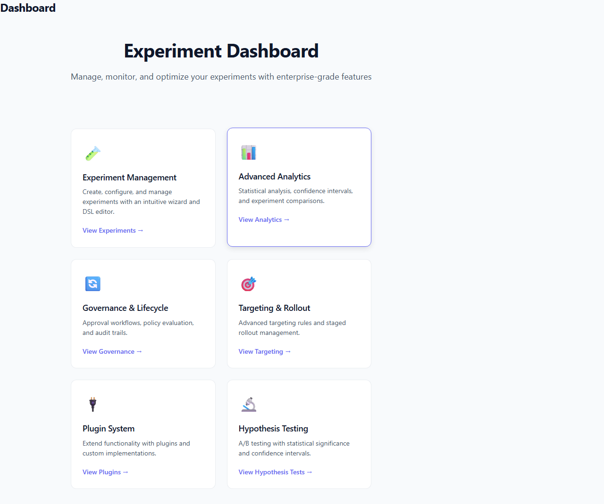
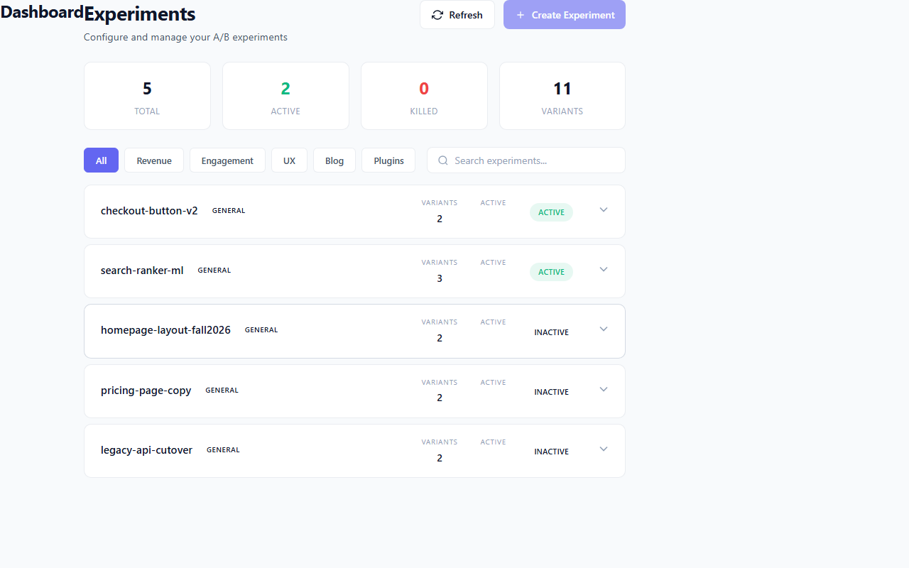

# Embed the Dashboard

This page shows you how to add the ExperimentFramework dashboard to an existing ASP.NET Core application. From adding the NuGet packages to browsing the live UI, the whole setup takes under ten minutes.

## Prerequisites

Before you start, make sure you have:

- **.NET 10 SDK** — the dashboard targets `net10.0`. Verify with `dotnet --version`.
- **An existing ASP.NET Core Web Application** — Blazor Server, Razor Pages, or MVC all work. The dashboard is a self-contained Razor Class Library mounted at a route prefix of your choice.
- **Authentication middleware** — if you plan to lock the dashboard to authorised users (recommended for production), you need either cookie authentication or an OIDC provider configured. The minimal wiring below shows a cookie/OIDC-agnostic approach; see the Troubleshooting section if you hit 401s.

## Step 1: Install the NuGet Packages

The dashboard is split across two packages. Add both to your host project:

```bash
dotnet add package ExperimentFramework.Dashboard
dotnet add package ExperimentFramework.Dashboard.UI
```

`ExperimentFramework.Dashboard` contains the middleware, REST API endpoints, and `DashboardOptions`. `ExperimentFramework.Dashboard.UI` is the Razor Class Library with all Blazor components — the CSS, JavaScript, and page routing live here.

If you are also registering the experiment framework itself for the first time (rather than embedding the dashboard into an app that already uses ExperimentFramework), add the core package too:

```bash
dotnet add package ExperimentFramework
```

## Step 2: Register Experiments

> **Skip this step** if your application already calls `AddExperimentFramework`.

In `Program.cs`, declare your experiments using the fluent builder and register them with the DI container. Each `Define<TService>` call maps a service interface to one or more trial implementations, keyed by a feature flag:

```csharp
// Register concrete implementations first so the builder can resolve them.
builder.Services.AddScoped<IGreetingService, ControlGreetingService>();
builder.Services.AddScoped<IGreetingService, VariantGreetingService>();

var config = ExperimentFrameworkBuilder.Create()
    .Define<IGreetingService>(experiment => experiment
        .UsingFeatureFlag("UseVariantGreeting")
        .AddDefaultTrial<ControlGreetingService>("control")
        .AddTrial<VariantGreetingService>("variant"))
    .UseDispatchProxy();

builder.Services.AddExperimentFramework(config);
```

`UseDispatchProxy()` enables runtime-based trial dispatch without any code generation step — the right choice when you are getting started. You can switch to source-generated proxies later for production performance tuning.

## Step 3: Register Dashboard Services

Still in `Program.cs`, call `AddExperimentDashboard` before `builder.Build()`. At minimum you need:

```csharp
builder.Services.AddRazorComponents()
    .AddInteractiveServerComponents();

builder.Services.AddExperimentDashboard(options =>
{
    options.PathBase             = "/dashboard";
    options.Title                = "My App — Experiments";
    options.EnableAnalytics      = true;
    options.EnableGovernanceUI   = true;
    options.RequireAuthorization = true;   // set false only during local development
});
```

`AddRazorComponents().AddInteractiveServerComponents()` is required because the dashboard UI uses Blazor Server interactive rendering. If your application already calls this, do not call it twice — just ensure `.AddInteractiveServerComponents()` is chained.

The options that matter most at this stage are:

| Option | Default | Notes |
|--------|---------|-------|
| `PathBase` | `/dashboard` | The URL prefix where the dashboard lives |
| `Title` | `Experiment Dashboard` | Shown in the browser tab and top nav |
| `EnableAnalytics` | `true` | Shows the Analytics page in the nav |
| `EnableGovernanceUI` | `true` | Shows Governance pages |
| `RequireAuthorization` | `false` | Set `true` to protect the dashboard |
| `AuthorizationPolicy` | `null` | Custom policy name; see Step 4 |

## Step 4: Configure Authorization (Recommended)

When `RequireAuthorization = true`, the dashboard honours ASP.NET Core authorization policies. Define a policy and assign it:

```csharp
builder.Services.AddAuthorization(options =>
{
    options.AddPolicy("DashboardAccess", policy =>
        policy.RequireAuthenticatedUser()
              .RequireRole("Admin", "Experimenter"));
});
```

Then pass the policy name in `AddExperimentDashboard`:

```csharp
builder.Services.AddExperimentDashboard(options =>
{
    options.PathBase             = "/dashboard";
    options.RequireAuthorization = true;
    options.AuthorizationPolicy  = "DashboardAccess";
});
```

During early local development it is convenient to set `RequireAuthorization = false` so you can reach the dashboard without logging in. Flip it to `true` before deploying to any shared environment.

## Step 5: Map the Dashboard Endpoint

After `var app = builder.Build()`, add the middleware and endpoint mapping. Order matters: authentication and authorization must be in the pipeline before the dashboard endpoint is hit.

```csharp
var app = builder.Build();

app.UseAuthentication();
app.UseAuthorization();
app.UseAntiforgery();

// Map the dashboard REST API (experiments, governance, analytics).
app.MapExperimentDashboard("/dashboard");

// Map Blazor SSR components — this serves all /dashboard/* pages.
app.MapRazorComponents<App>()
    .AddInteractiveServerRenderMode();
```

`MapExperimentDashboard` registers the REST API route group under `/dashboard/api`. The Blazor component mapping handles the UI pages at `/dashboard`, `/dashboard/experiments`, `/dashboard/analytics`, and so on.

Your `App.razor` (or root component) must include `<Routes />` with routing enabled. If you do not have an `App.razor` yet, refer to the [sample host source](sample-host.md) for a minimal working example.

## Step 6: Verify

Run your application and browse to `https://localhost:5001/dashboard` (or your configured port). You should see the dashboard home page showing the navigation grid:



The home page confirms that routing, static assets, and Blazor interactive server rendering are all wired correctly. The six feature cards — Experiment Management, Advanced Analytics, Governance, Targeting, Plugins, and Hypothesis Testing — correspond to the major sections of the dashboard.

After you register experiments and navigate to the Experiments page (`/dashboard/experiments`), you will see them listed with their status, variant count, and rollout percentage:



The stats row at the top summarises totals across all experiments: 5 Total, 2 Active, 0 Killed, 11 Variants in the screenshot above. Each row in the list is expandable — click a row to see arm definitions, rollout controls, and the kill-switch toggle.

## Multi-Tenancy

ExperimentFramework supports tenant-scoped experiments. When a `TenantResolver` is configured, the dashboard automatically scopes all data reads and writes to the resolved tenant context. Assign a resolver through `DashboardOptions`:

```csharp
builder.Services.AddExperimentDashboard(options =>
{
    options.PathBase     = "/dashboard";
    options.TenantResolver = new HttpHeaderTenantResolver("X-Tenant-Id");
});
```

Built-in resolvers include `HttpHeaderTenantResolver` (reads a request header), `ClaimTenantResolver` (reads a JWT/cookie claim), and `NullTenantResolver` (default — single-tenant mode). For composite strategies or custom resolution logic, implement `ITenantResolver` directly.

For details on durable cross-node experiment state with multi-tenant isolation, see the [Distributed Systems reference](../../reference/distributed.md).

## Troubleshooting

**401 Unauthorized / login redirect on every request**
Ensure `UseAuthentication()` and `UseAuthorization()` appear in the pipeline *before* `MapExperimentDashboard`. ASP.NET Core middleware runs top-to-bottom; if authorization runs before authentication has populated `HttpContext.User`, every request looks like an anonymous request.

**Blank page at `/dashboard`**
The most common cause is missing Blazor assets. Verify:
1. You called `.AddInteractiveServerComponents()` when registering Razor components.
2. Your project references `ExperimentFramework.Dashboard.UI` — this package contains the CSS and JavaScript bundles.
3. `app.MapStaticAssets()` (or `app.UseStaticFiles()`) is called before `app.MapRazorComponents`.
4. If you are running in non-Development mode, add `builder.WebHost.UseStaticWebAssets()` so static web assets from Razor Class Libraries are served.

**404 on `/dashboard` or `/dashboard/experiments`**
`MapRazorComponents<App>()` must be called with `.AddInteractiveServerRenderMode()` and your `App.razor` must declare `<Routes />`. Without the routing component, Blazor renders the root component but has no routing table to match `/dashboard/*` paths.

**`InvalidOperationException: DashboardOptions not found in DI`**
You called `app.UseExperimentDashboard()` or `app.MapExperimentDashboard()` without first calling `builder.Services.AddExperimentDashboard(...)`. The middleware reads `DashboardOptions` from the service container; register it during the services phase.

**Experiments do not appear on the Experiments page**
The dashboard reads experiments from `IExperimentRegistry`, which is populated by `AddExperimentFramework`. Ensure you called `AddExperimentFramework(config)` with at least one `Define<TService>` entry, and that your concrete trial types are registered in DI before `AddExperimentFramework` is called.

## Related

- [Run the Sample Host](sample-host.md) — explore a pre-seeded dashboard without writing any application code
- [Production Checklist](production-checklist.md) — security, performance, and observability considerations before going live
- [Operator Guide](../operator-guide/toc.yml) — how to manage experiments, governance policies, and rollouts after the dashboard is deployed
- [Admin API Reference](../../reference/admin-api.md) — REST endpoint specification for programmatic access
