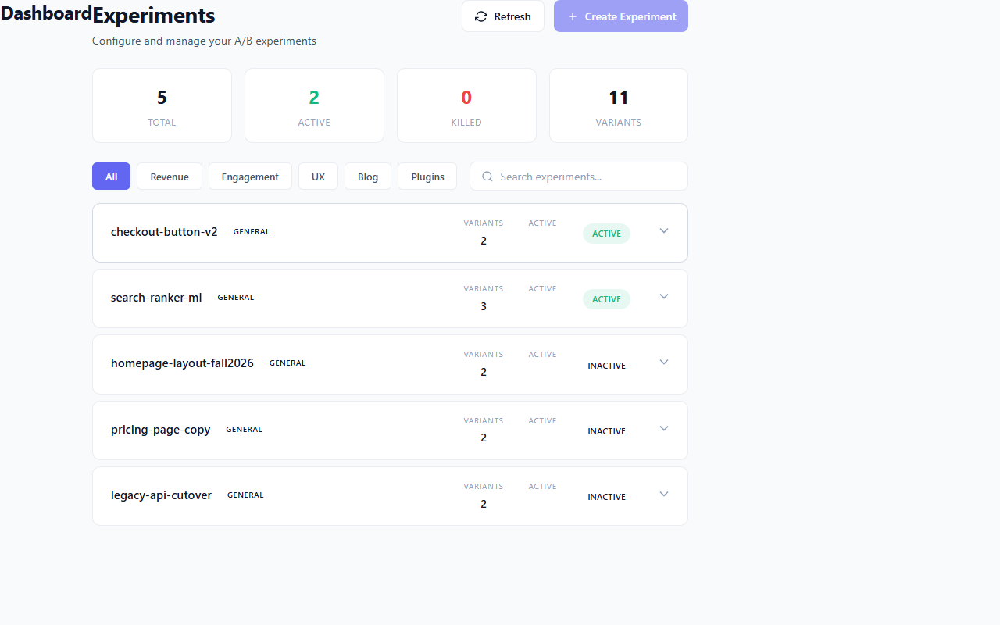
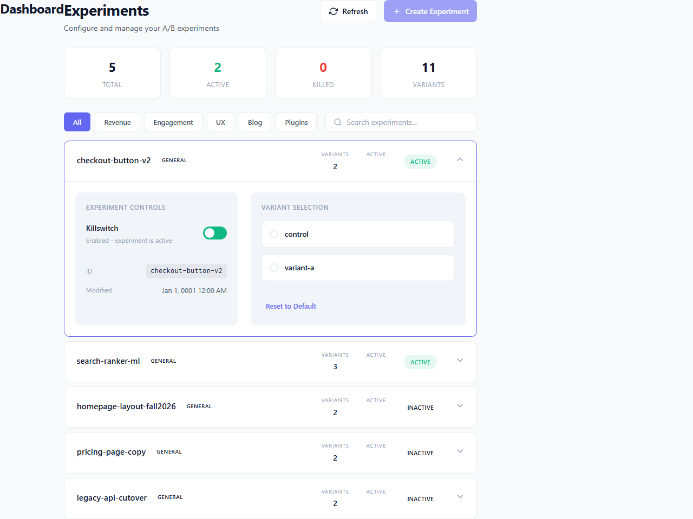
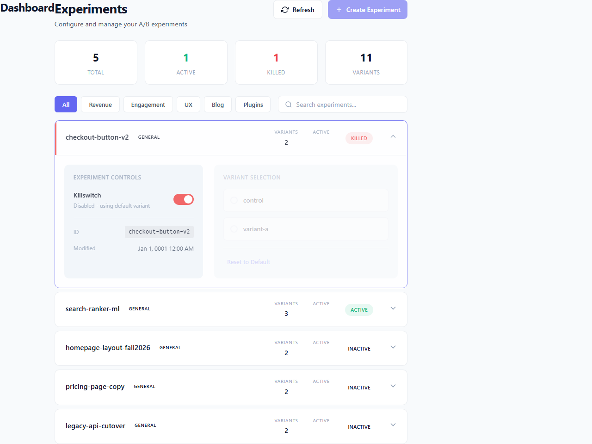

# Tutorial: Your First Experiment

> **You will learn:** How to navigate the Experiments page, understand an active A/B experiment, inspect its arms, and use the kill-switch to pause it.
> **You will need:** Admin or Experimenter role. The sample host running with `--seed=docs`.
> **Estimated time:** ~10 minutes.

## Before you begin

Make sure the dashboard host is running in docs-demo mode. Start it from the repository root:

```bash
dotnet run --project samples/ExperimentFramework.DashboardHost \
  -- --seed=docs --freeze-date 2026-04-01T12:00:00Z
```

Once you see `Now listening on: http://localhost:5195`, navigate to `http://localhost:5195/dashboard` in a browser. The docs seed pre-loads five real experiments — you do not need to create anything to follow this tutorial.

## Step 1: Open the Experiments page

From the left navigation, click **Experiments**, or go directly to `/dashboard/experiments`.


1. **Stats row** — four cards at the top summarise the whole registry: *Total* (5), *Active* (how many are not killed and have status Active), *Killed* (how many have a kill-switch currently engaged), and *Variants* (total variant count across all experiments). These numbers update immediately when you make changes on this page.
2. **Category filters** — the pill buttons (All, Revenue, Engagement, UX, Blog, Plugins) narrow the list to experiments tagged with that category. Click **All** to reset.
3. **Search box** — type any substring of an experiment name to filter in real time; no submit required.
4. **Experiment rows** — each row shows the experiment's machine-readable name, its category tag, variant count, active variant name, and a status badge (ACTIVE or INACTIVE). Click any row to expand it.

## Step 2: Inspect an existing experiment's detail view

Click the `checkout-button-v2` row to expand it.


The expanded view is split into two panels. The **Experiment Controls** panel (left) shows the kill-switch toggle, the experiment's machine ID, and the last-modified timestamp. The **Variant Selection** panel (right) lists every arm and highlights the currently active one.

1. **Killswitch toggle** — a green toggle means the experiment is live and traffic is being assigned to variants according to the selection logic. A red toggle means the experiment is killed: all traffic falls back to the default (control) arm immediately, without a deployment.
2. **ID field** — the machine-readable identifier used in code, API calls, and configuration YAML (`checkout-button-v2`). This must match exactly when you call `IExperimentFramework.IsActive()` or configure feature flags.
3. **Modified timestamp** — shows the last wall-clock time the registry snapshot was updated. In the demo seed this reflects the frozen date `Jan 1, 0001` because the in-memory registry does not persist timestamps.

## Step 3: Understand the arms (variants)

With `checkout-button-v2` still expanded, look at the **Variant Selection** panel on the right.


An experiment's *arms* (also called *variants* or *trials*) are the alternative implementations being compared. For `checkout-button-v2` there are two:

1. **control** — the existing production implementation (`CheckoutButtonControl`). This is the baseline that new traffic falls back to when an experiment is killed. In code it is registered with `.AddDefaultTrial<CheckoutButtonControl>("control")`.
2. **variant-a** — the challenger implementation (`CheckoutButtonVariantA`). Click its card to make it the active arm; click **Reset to Default** to return to `control`.

When the kill-switch is enabled (green), the active arm receives the traffic share determined by the rollout percentage and targeting rules. When killed, all participants see `control` regardless of which arm is marked active.

For deeper reading on arm lifecycle and promotion rules, see the [Experiments reference](../../reference/experiments.md) and the [Governance lifecycle reference](../../reference/governance-lifecycle.md).

## Step 4: Read the experiment list at a glance

Collapse `checkout-button-v2` by clicking its row again, then observe the full list.



Each row gives you the information you need to triage a live system at a glance:

1. **Name + category tag** — `checkout-button-v2 GENERAL`. The category tag corresponds to the filter pills at the top; use it to organise experiments by product area.
2. **Variants count** — `checkout-button-v2` has 2, `search-ranker-ml` has 3. A 3-arm experiment requires more traffic to reach statistical significance, so factor this into your rollout plan.
3. **Active column** — shows the currently-selected arm name (`control`, `ml-v1`, etc.). During an ongoing experiment you can change this without redeploying; the framework's dispatch proxy reroutes calls in real time.
4. **Status badge** — `ACTIVE` (teal) means the experiment's kill-switch is enabled and traffic is being split. `INACTIVE` (grey) means the experiment is registered but its kill-switch is off, so all traffic uses the default arm.

## Step 5: Toggle the experiment

Expand `checkout-button-v2` again and click the **Killswitch** toggle to turn the experiment off.





1. **Optimistic update** — the UI reflects the change immediately (toggle turns red, badge changes to KILLED, stats row decrements Active and increments Killed) before the API call completes. If the API returns an error the UI reverts.
2. **Killed styling** — the experiment row gains a red left border and the Variant Selection panel greys out, indicating that arm selection has no effect while the experiment is killed.
3. **Stats row** — Active drops from 2 to 1 and Killed increments to 1. These numbers are a live summary of the whole registry, so they reflect every active session's changes.
4. **Re-enabling** — click the toggle again to return to the green (enabled) state. Traffic resumes being split across arms without any code deployment.

## What next

With the basics of navigation, arm inspection, and the kill-switch covered, you are ready to move on to more advanced operator workflows:

- [Progressive rollout tutorial](progressive-rollout.md) — scale your experiment from 10% to 100% of users gradually.
- [Approval and promotion](approval-and-promotion.md) — require two-approver sign-off before an experiment goes live.
- [Experiments reference](../../reference/experiments.md) — full control reference for the Experiments page, including selection modes and error policies.
- [Governance lifecycle reference](../../reference/governance-lifecycle.md) — understand the Draft → Review → Approved → Running → Concluded lifecycle and when each transition is triggered.
